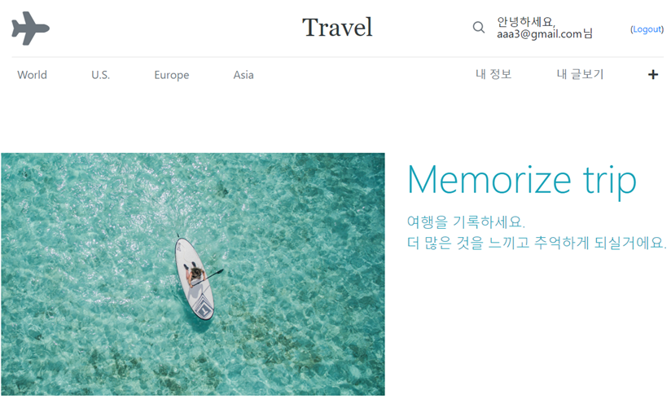
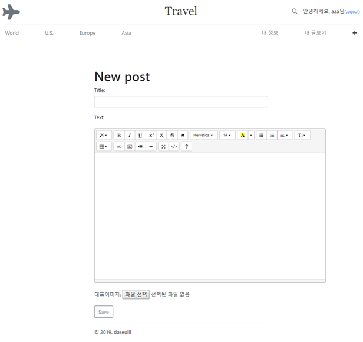

# 여행블로그 개발 프로젝트

- 여행블로그 컨셉으로 글 작성/수정/삭제, 댓글 기능 등의 기본적인 블로그 기능과 user authentication 기능을 연습한 프로젝트입니다.

                                        
- 블로그 메인화면

---

- 글 작성 화면

---
 

## 개발환경
- Python 3.6 / Django 2.1.7

- Virtualenv로 가상환경 설정

- heroku 배포 설정

- PostgreSQL 연결 설정

- django-storages로 Amazon S3 연동 설정

- SECRET_KEY, AWS_ACCESS_KEY 등 중요한 key 값 환경변수 설정

 

## 주요 기능
- 글 작성자만 수정, 발행, 삭제할 수 있도록 구현

- 기존의 User객체를 대상으로 Profile객체를 생성하기 위한 커스텀 migration

- 회원가입 시 User객체와 Profile객체를 동시에 생성하고 회원가입 시 Profile 입력받기

- 회원가입 시 새로운 user에게 가입환영 이메일 발송 기능

- url reverse로 효율적인 url관리

- 로컬환경과 개발환경 세팅파일 분리 (local.py, prod.py)

- 환경변수로 SECRET_KEY, AWS_ACCESS_KEY 등 비밀값 관리

 

## 배포
- heroku로 배포 

- Amazon S3와 연동하여 이미지파일 관리
